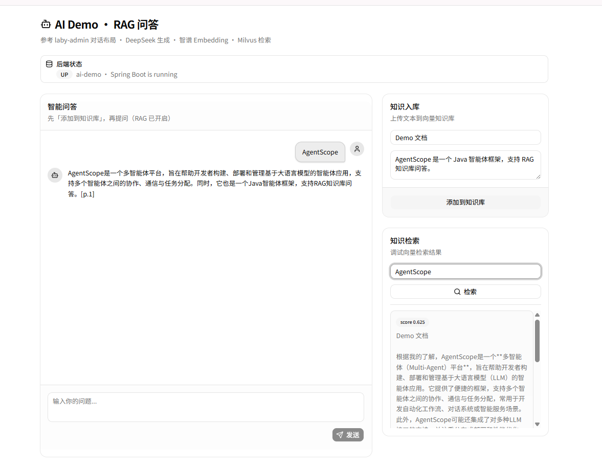
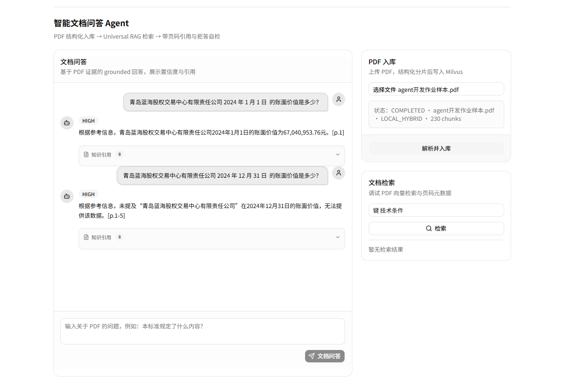
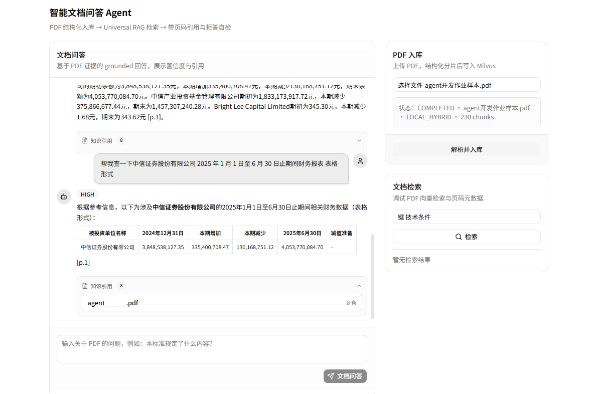

# 演示截图说明

> 作业要求提供 5–10 分钟演示视频或清晰截图。本项目以 **截图** 代替视频，覆盖完整闭环。

## 1. 启动与系统概览

后端 Spring Boot 已启动，前端可访问；通用 RAG 问答与 Milvus 检索可用。



**说明：**
- 后端状态 `UP`（Spring Boot 8050）
- 左侧：通用 `/api/chat`，RAG 已开启（DeepSeek 生成 + 智谱 Embedding + Milvus）
- 右侧：知识入库 + 向量检索调试（score 0.625）
- 回答末尾带页码引用 `[p.1]`

---

## 2. PDF 入库

在 **智能文档问答 Agent** 区域上传 PDF，等待解析完成。

| 字段 | 截图中的值 |
|------|-----------|
| 状态 | `COMPLETED` |
| 文件 | `agent开发作业样本.pdf` |
| 解析类型 | `LOCAL_HYBRID` |
| 分片数 | `230 chunks` |

入库入口见下方两张截图右侧「PDF 入库」面板。

---

## 3. 问答示例（≥5 题中的核心场景）

### 3.1 正文 / 实体问题（有依据 + 引用）

**问题：** 青岛蓝海股权交易中心有限责任公司 2024 年 1 月 1 日的账面价值是多少？

**结果：** `confidence=HIGH`，回答 **67,040,953.76 元**，引用 `[p.1]`，展开 **知识引用 8** 条证据。



---

### 3.2 无答案 / 拒答（文档无依据）

**问题：** 青岛蓝海股权交易中心有限责任公司 2024 年 12 月 31 日的账面价值是多少？

**结果：** 模型依据 Reference 说明文档**未提及该日期数据**，不编造数值（体现拒答/无依据意识）。


> 同一张截图包含「有答案」与「无答案」两题对比，便于评审对照。

---

### 3.3 表格问题（必做）

**问题：** 请列出 2025 年 1 月 1 日至 6 月 30 日期间财务报表中，中信证券股份有限公司表格数据。

**结果：** `confidence=HIGH`，以 **Markdown 表格** 列出被投资单位、2024-12-31、本期增减、2025-06-30 等列，引用 `[p.1]`，8 条知识引用。



---

## 4. 来源引用与自检

| 能力 | 截图体现 |
|------|----------|
| 页码引用 | 答案末尾 `[p.1]` / `[p.1-5]` |
| 证据片段 | 「知识引用 N」可展开 snippet |
| 置信度 | `HIGH` 标签 |
| 拒答意识 | 文档无数据时不编造（见 3.2） |

---

## 5. 测试运行

单元测试不依赖外部 API，本地执行：

```bash
mvn test
cd frontend && npm test
```

期望全部 PASS。问题集参考：`src/test/resources/eval/gbt1568-questions.json`。

---

## 6. 与作业附件 PDF 的说明

截图演示使用 **`agent开发作业样本.pdf`**（含金融表格与账面价值场景），与作业附件 **`GBT 1568-2008 键 技术条件.pdf`** 同属「扫描/复杂 PDF → RAG 问答」链路；标准文档问答流程一致，上传 GBT 1568 后可在同一界面复现。

作业附件演示建议问题见 [TEST.md](TEST.md#4-人工测试用例演示必做-5-题)。
